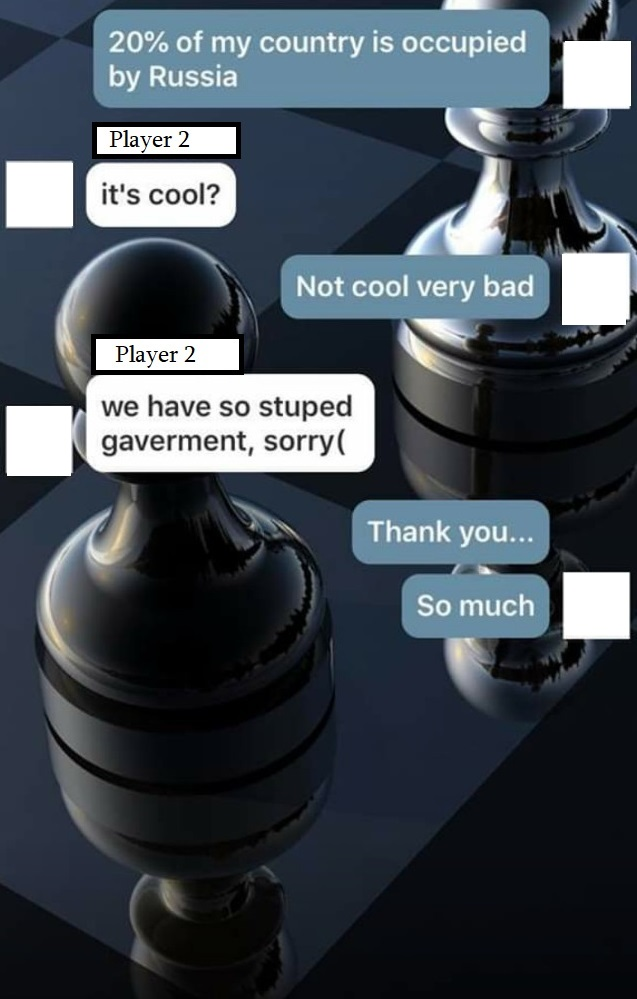
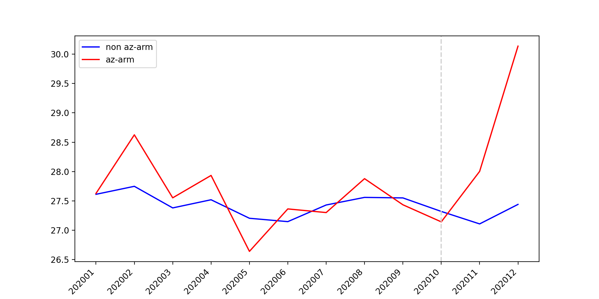
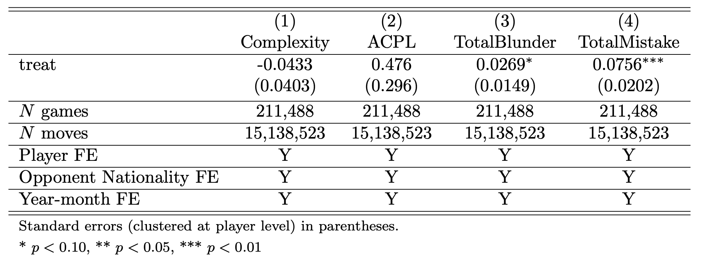
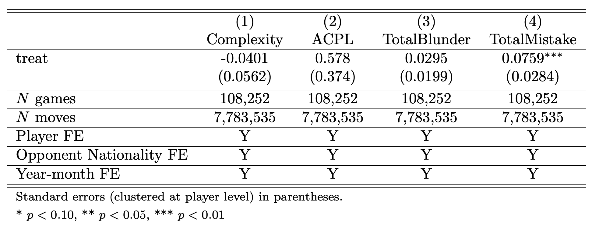

```{r setup, include=FALSE}
options(htmltools.dir.version = FALSE)
```


$\\[1cm]$
```{r,echo=F, out.width="50%",fig.align="center"}

```

---

**Research question:**
- Is nationalism "a thing" in online platforms? 

--
  - Do participants response to international conflicts? <br> Behavioral responses, aggressiveness..
  
--
- Potentially problematic for the platform. (Organizer's POV)
  
--

<br>

- Broader: Do *residents* of countries get more hostile towards each other during a war?

--

<blockquote>Or, is war "just politics"?</blockquote>

---

# Conflicts

Uppsala Conflict Data Program (UCDP) Dyadic Dataset version 23.1

- Two countries
- "Substantial" military involvement (X number of soldiers actively engaged)
- Since 2010

---

# Conflicts

Nagorno-Karabakh conflict between Azerbaijan and Armenia, Oct-Nov 2020

~5,000-10,000 casualties (mostly military)

```{r out.width='100%', fig.height=4, eval=require('leaflet')}
library(leaflet)
leaflet() %>% addTiles() %>% setView(43.1, 41.5, zoom = 5)
```

---

# Conflicts

Conflict between Ukraine and Russia, Feb 2022-cont.

\>100,000 casualties (military and civilian)

```{r out.width='100%', fig.height=4, eval=require('leaflet')}
library(leaflet)
leaflet() %>% addTiles() %>% setView(33.1, 51.5, zoom = 4)
```

---
# Research setting
- No international contest between two countries during a war
  - E.g., Russian soccer team was banned from competing in the 2022 World Cup in Qatar.
- But, [chess.com](https://chess.com) operates 24/7! (the biggest online chess platform)
  - ~30,000 games happen each hour worldwide
--

- We scraped games played by Armenian, Azerbaijani, Ukrainian, and Russian players before and after the start of conflict
  - Arm-Az: ~8,000 games with 2,200 during conflict
  - Ukr-Ru: ~48,000 games with 18,000 during conflict

$\\[.15cm]$

--
**Research question:**
- Do people (chess players) reflect international conflict on their behavior?
  - How do they perform? I.e., accuracy
  - Do they play more "aggressively"?
  - Does the impact depend on who initiated the war/army size?

---

# Relevant Literature

- Conflicts alter perception and foster identity: Caceres-Delpiano et. al. (2021), Gehring (2022) among others.

- Performance under stress: Cahlíková et. al. 2020 etc.

- Conflict & soccer data
  - Depetris-Chauvin et. al. (2020): Africa Cup of Nations & civil conflict
  - Caruso et. al. (2017): Referee decisions
  - Miguel et. al. (2010): Violent behavior on the pitch

---

# Chess data

$\\[1cm]$
```{r,echo=F, out.width="40%",fig.align="center"}
knitr::include_graphics("image7.png")
```

---
# Chess data


---

# Chess data

$\\[1cm]$
```{r,echo=F, out.width="40%",fig.align="center"}
knitr::include_graphics("image2.png")
```

---

# Chess data: Board Complexity

- Estimate probability of making a mistake on a given position
  - Most positions are unique, so can't look at historical data
  - **Solution:** Machine learning, e.g., a neural network that learns the "types" of positions and where mistakes happen the most

```{r,echo=F, out.width="70%",fig.align="center"}
knitr::include_graphics("image3.png")
```
$\\[.1cm]$
- Trained on a separate sample with 25,000 games played in tournaments, ~2 million moves
- Use the model to estimate the complexity of games in the "conflict sample"

---

# Chess data: Board Complexity

$\\[1cm]$
```{r,echo=F, out.width="80%",fig.align="center",fig.cap="Histograms for ACPL (actual mistakes) vs. Complexity (estimated mistakes) mean ACPL = 72, estimated mean ACPL = 27"}
knitr::include_graphics("image5.png")
```

---

# Chess data: Board Complexity

$\\[1cm]$
```{r,echo=F, out.width="60%",fig.align="center",fig.cap="Scatterplot of ACPL (actual mistakes) against Complexity (estimated mistakes) slope = 2.32 with SE=.03"}
knitr::include_graphics("image6.png")
```

---

# Empirical Strategy

- Simple DiD:

<br>

$Y_{ijg}=\gamma H_{ijg}+\pmb{X_{ijg}}'\pmb{\beta}+T_g+N_j+\alpha_i+u_{ijg}$

where $H_{ijg}$ equals 1 if a game $g$ between player $i$ and player $j$ happened between players of "treated" countries post the conflict starting date.

$Y_{ijg}$ include performance: average mistake, blunders; game outcomes e.g., win, loss; and the choice of game complexity.
  - Secondary outcomes: "How the game ended": e.g., "agree" to a draw, "stalling" a game; game length (measured by total number of moves).
---

# Results

```{r,echo=F, out.width="99%",fig.align="center",fig.cap="Reduced form results, Complexity, AZ-ARM conflict"}

```
---

# Results

```{r,echo=F, out.width="99%",fig.align="center",fig.cap="Reduced form results, ACPL, AZ-ARM conflict"}
knitr::include_graphics("image1212.png")
```
---

# Results

```{r,echo=F, out.width="99%",fig.align="center",fig.cap="Reduced form results, Complexity, UA-RU conflict"}
knitr::include_graphics("image13.png")
```
---

# Results

```{r,echo=F, out.width="99%",fig.align="center",fig.cap="Reduced form results, ACPL, UA-RU conflict"}
knitr::include_graphics("image14.png")
```

---

# Results

$\\[1cm]$
```{r,echo=F, out.width="90%",fig.align="center"}
knitr::include_graphics("counts-azarm.png")
```
---

# Results

$\\[1cm]$
```{r,echo=F, out.width="90%",fig.align="center"}
knitr::include_graphics("counts-uaru.png")
```
---

# Results

$\\[1cm]$
```{r,echo=F, out.width="60%",fig.align="center",fig.cap="Differences in Differences regression results, AZ-ARM conflict (all sample)"}
knitr::include_graphics("graph1a.png")
```
---

# Results

$\\[1cm]$
```{r,echo=F, out.width="60%",fig.align="center",fig.cap="Differences in Differences regression results (Azeri players)"}
knitr::include_graphics("graph2a.png")
```
---

# Results

$\\[1cm]$
```{r,echo=F, out.width="60%",fig.align="center",fig.cap="Differences in Differences regression results (Armenian players)"}
knitr::include_graphics("graph3a.png")
```
---

# Results

$\\[1cm]$
```{r,echo=F, out.width="53%",fig.align="center",fig.cap="Differences in Differences regression results: game outcomes"}
knitr::include_graphics("graph4a.png")
```
---

# Results

$\\[1cm]$
```{r,echo=F, out.width="80%",fig.align="center",fig.cap="Differences in Differences regression results: secondary outcomes"}
knitr::include_graphics("graph5a.png")
```
---

# Results

$\\[1cm]$
```{r,echo=F, out.width="60%",fig.align="center",fig.cap="Differences in Differences regression results, UA-RU conflict (all sample)"}

```
---

# Results

$\\[1cm]$
```{r,echo=F, out.width="60%",fig.align="center",fig.cap="Differences in Differences regression results (Ukrainian players)"}

```
---

# Results

$\\[1cm]$
```{r,echo=F, out.width="60%",fig.align="center",fig.cap="Differences in Differences regression results (Russian players)"}
knitr::include_graphics("graph3u.png")
```
---

# Results

$\\[1cm]$
```{r,echo=F, out.width="55%",fig.align="center",fig.cap="Differences in Differences regression results: game outcomes"}
knitr::include_graphics("graph4u.png")
```
---

# Results

$\\[1cm]$
```{r,echo=F, out.width="95%",fig.align="center",fig.cap="Differences in Differences regression results: secondary outcomes"}
knitr::include_graphics("graph5u.png")
```
---

# Conclusion

- Conflicts impact the quality of performance of chess players.
- Marginal evidence for "more aggressive" games played.
- Impact is not uniform: Ukrainian and Azeri players showed worse performance.
  - "Initiating side" theory? `r emo::ji("cross_mark")`
  - Public support of the conflict? Both Russia and Armenia received weaker support.
    - More public support -> worse concentration and/or (some) more aggressiveness -> worse performance
  
---

class: center, middle

# Thanks!

Slides created via the R package [**xaringan**](https://github.com/yihui/xaringan).

Backend support from [remark.js](https://remarkjs.com), [**knitr**](https://yihui.org/knitr/), and [R Markdown](https://rmarkdown.rstudio.com).

For questions and comments, you can reach me at
[**bilene@dickinson.edu**](bilene@dickinson.edu).

```{r,echo=F, out.width="15%",fig.align="center"}
knitr::include_graphics("qr.png")
```
