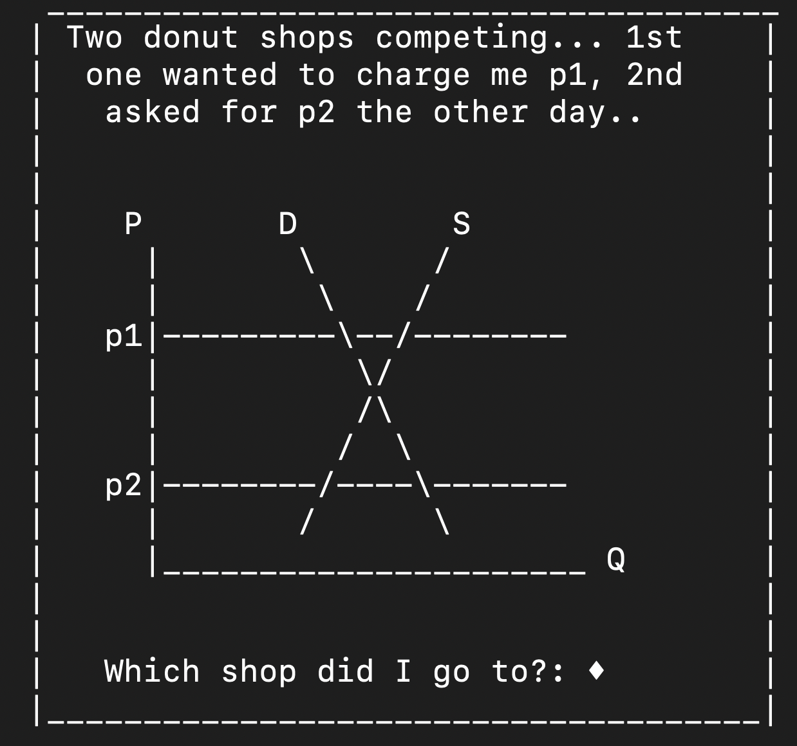

```{r setup, include=FALSE}
options(htmltools.dir.version = FALSE)
```

```{r,echo=F}
#library(countdown)
#countdown(minutes = 0, seconds = 10, top = 2,left = 5, right = 5)
```

# Comments
- My personal story with interactive graphing
- Biggest challenge: interface
 - I love it (and I'm very picky)
 - Should be in steps? ''Next page/Next exercise button'' bottom right.
 - Potential to gamify?: i.e. https://ncase.me/trust/
 - A second idea: Students come up with questions - other students solve
 
 ```{r,echo=F, out.width="45%",fig.align="center"}

```

---

# Comments cont.
- Field experiment (but still can compare cohorts) 
  - e.g., majoring in econ?
  - Performance? Gains should be biggest in graphing questions
- Citations from math lit. i.e., calculus?


---

class: center, middle

# Thanks for the paper!

Slides created via the R package [**xaringan**](https://github.com/yihui/xaringan).

Backend support from [remark.js](https://remarkjs.com), [**knitr**](https://yihui.org/knitr/), and [R Markdown](https://rmarkdown.rstudio.com).

For further questions/comments, you can reach me at
[**bilene@dickinson.edu**](bilene@dickinson.edu).

```{r,echo=F, out.width="15%",fig.align="center"}
knitr::include_graphics("qr.png")
```


